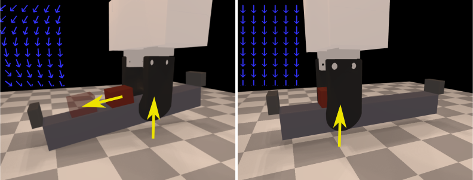

# Learning of Efficient Stable Robot Grasping Approach Using Transformer-based Control Policy

This repo contains the implementation of [Learning of Efficient Stable Robot Grasping Approach Using Transformer-based Control Policy]() (**ICIEA 2024** Best Paper Finalist) by 
[En Yen Puang](https://scholar.google.com/citations?user=jePmCqAAAAAJ), 
[Zechen Li](),
[Chee Meng Chew](https://scholar.google.com/citations?hl=en&user=woLCMSYAAAAJ),
[Shan Luo](https://scholar.google.com/citations?hl=en&user=ArnkrbwAAAAJ),
[Yan Wu](https://scholar.google.com/citations?hl=en&user=Pn1ZxxwAAAAJ).

[ [Paper]() ] [ [Page](https://stable-tactile-grasp.github.io/) ] [ [Slides]() ] 

<p align="center">
    </p>

## Table-of-Contents

1. [Installation](#Installation)
2. [Run the Examples](#Run-the-Examples)
3. [On Real UR5 & Sensor](#On-Real-UR5-&-Sensor)
4. [Citation](#Citation)

---

## Installation

Code adopted from [source](https://github.com/eanswer/TactileSimulation).

1. Clone the project:
   ```bash
   git clone git@github.com:enyen/TactileSimulation.git
   ```
2. Clone the submodule:
   ```bash
   mkdir -p externals/DiffHand
   git clone https://github.com/eanswer/DiffHand.git externals/DiffHand
   ```

3. Install **CMake** >= 3.1.0

4. Create conda environment 

   ```bash
   conda create -n tactile_sim python=3.9
   conda activate tactile_sim
   pip install torch torchvision scikit-learn opencv-python einops stable_baselines3 tensorboard scipy pyyaml tqdm rich matplotlib pybind11 math3d=3.4.1 git+https://github.com/enyen/python-urx
   ```

5. Install `DiffRedMax`

   ```bash
   sudo apt-get install freeglut3-dev libglfw3-dev libxinerama-dev livxcursor-dev libxi-dev libxxf86vm-dev   
   cd externals/DiffHand/core
   python setup.py install
   ```

---

## Run the Examples

Training in simulation:
```bash
cd examples/UnstableGraspExp
python train_sb3.py
```

Testing in simulation using model saved in _ug_datetime_:
```bash
python train_sb3.py ./storage/ug_datetime.zip vis_mode
```
_vis_mode_ can be either: 
1. 'None' -> no visualization, just statistic
2. 'show' -> visualize every steps
3. 'record' -> produce a video of the whole episode

Visualize training progress using tensorboard:
```bash
tensorboard --logdir log
```

Getting normalization stats:
```python
# cd bash

from unstable_grasp_env import UnstableGraspEnv
env = UnstableGraspEnv()
env.data_stat()
# update self.tactile_means and self.tactile_stds manually inside __init__.
```

<p align="center">
    </p>

---

## On Real UR5 & Sensor

Build marker flow library (adopted from [source](https://github.com/GelSight/tracking)).
```commandline
cd examples/UnstableGraspExp/marker_flow
make
```

Test marker flow 
```python
 # cd examples/UnstableGraspExp

 from marker_flow.marker_flow import MarkerFlow
 mf = MarkerFlow()
 #  ...  follow through to select camera id
 mf._run(debug=True, collect=False)
 #  ...  view marker flow visualization, ctrl-c to stop
```

<p align="center">
    </p>

Collect sensor means and stds:
```bash
cd examples/UnstableGraspExp
python test_ur5.py
```

Actual testing:
```bash
python test_ur5.py ./storage/ug_datetime
```

---

## Citation

Please cite our paper if you use this code.

     @inproceedings{,
        title={},
        author={},
        booktitle={},
        pages={},
        year={},
        organization={}
      }
