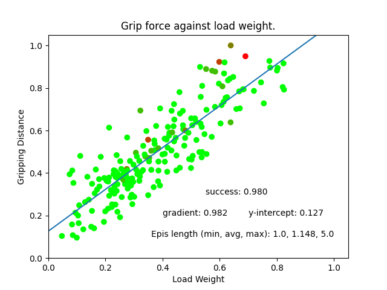

# Tactile-Based Control Environments
Adopted from [source](https://github.com/eanswer/TactileSimulation).

## Installation

---

1. Clone the project and its submodule from github: `git clone git@github.com:enyen/TactileSimulation.git --recursive `.

2. Install **CMake** >= 3.1.0

3. Create conda environment 

   ```
   conda create -n tactile_sim python=3.9
   conda activate tactile_sim
   pip install torch torchvision scikit-learn opencv-python einops stable_baselines3 tensorboard scipy pyyaml tqdm rich matplotlib pybind11 math3d=3.4.1 git+https://github.com/enyen/python-urx
   ```

5. Install `DiffRedMax`

   ```
   sudo apt-get install freeglut3-dev libglfw3-dev libxinerama-dev livxcursor-dev libxi-dev libxxf86vm-dev   
   cd externals/DiffHand/core
   python setup.py install
   ```

## Run the examples

---

### Tactile Unstable Grasp

Training in simulation:
```commandline
cd examples/UnstableGraspExp
python train_sb3.py
```

Testing in simulation using model saved in _ug_datetime_:
```commandline
python train_sb3.py ./storage/ug_datetime.zip vis_mode
```
_vis_mode_ can be either: 
1. 'None' -> no visualization, just statistic
2. 'show' -> visualize every steps
3. 'record' -> produce a video of the whole episode

Visualize training progress using tensorboard:
```commandline
tensorboard --logdit log
```

Getting normalization stats:
```python
#  cd env
#  python
from unstable_grasp_env import UnstableGraspEnv
env = UnstableGraspEnv()
env.data_stat()
# update self.tactile_means and self.tactile_stds manually inside __init__.
```


<p align="center">
    </p>

<p align="center">
    </p>


### On real UR5 & Sensor

---

Build marker flow library (adopted from [source](https://github.com/GelSight/tracking)).
```commandline
cd examples/UnstableGraspExp/marker_flow
make
```

Test marker flow 
```python
 # cd examples/UnstableGraspExp
 # python
 from marker_flow.marker_flow import MarkerFlow
 mf = MarkerFlow()
 #  ...  follow through to select camera id
 mf._run(debug=True, collect=False)
 #  ...  view marker flow visualization, ctrl-c to stop
```

<p align="center">
    </p>

Collect sensor means and stds:
```commandline
cd examples/UnstableGraspExp
python test_ur5.py
```

Actual testing:
```commandline
python test_ur5.py ./storage/ug_datetime
```
